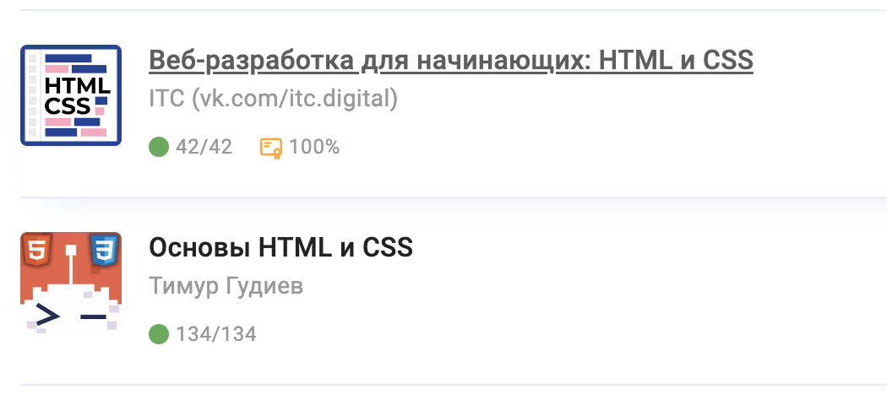

# Santalava Uladzislava

## Junior Frontend Developer
---
## Contact information:
🇵🇱**Location:** Poland, Warsaw.\
📱**Phone:** +48 789 632 433\
✉️**E-mail:** santalova.lada25@gmail.com\
👋**Telegram:** @sunlaa\
🔮**Discord:** @sunlaa\
💾**GitHub:** [sunlaa](https://github.com/sunlaa)

---
## Brief information about me
I am 20 years old and by now I have been studying web technologies for about 1.5 years. I got interested in programming at school. I always liked solving math problems, finding new solutions on my own, and being happy when everything worked out. All this is possible in turn due to my analytical mind. In addition, my strengths include attentiveness, calmness and immersion in what I do. My goal is to gain knowledge and use it to develop myself. 


---
## Skills
- HTML, CSS
- JavaScript
- React (basics)
- Git, GitHub
- Visual Studio Code
- Mac OS, Windows OS

---
## Code example
*[Task](https://www.codewars.com/kata/65127141a5de2b1dcb40927e)*

**Description:** we are given an array of a random number of "left" and "right" strings. Each such element rotates something to the right or back to the left by 90 degrees. Our task is to calculate the number of full rotations of 360 degrees.\
*As here:*
```
["left", "right", "left", "right"] ➞ 0
["right", "right", "right", "right", "right", "right", "right", "right"] ➞ 2
```
**My solution:**
```javascript
function spinAround(turns) {
  let a = 0
  let b = 0
  let sum = 0
  for (let dir of turns) {
    if (dir == 'right') {
      a++
    } else if (dir == 'left') {
      b++
    }
  }
  
  (a > b) ? sum = a - b : sum = b - a
  
  return Math.floor(sum/4)
}
```

---
## Training received
- Taking micro-courses on the **Stepik** educational platform

- Learning JavaScript from Ilya Kantor's tutorial **["The Modern JavaScript Tutorial"](https://learn.javascript.ru/)**\
*[Detailed textbook summary](https://www.notion.so/JavaScript-de40ed91d56a45e7b4ecc50209a994bb?pvs=4)*

- Learning the basics of React through **[the official documentation](https://react.dev/learn)**

---
## My little first project
I created this project to practice layout, CSS and HTML. It has a couple of hyperlinks and a button to go to another page. It also has some sort of adaptive layout, but since it was my first attempt, it doesn't look the way I would like it to on all devices.\
**[You can see it here](https://github.com/sunlaa/learning-site)**

---
## Language
- **Russian**
- **Belarusian**
- ### English
  - [EPAM English test result](https://examinator.epam.com/Main/PersonalAssignments): **B1(Intermediate)**\
  At the moment I live in Poland and because I don't know Polish, I occasionally use English to communicate. I am learning English now through lessons, videos and self-talk with recordings.